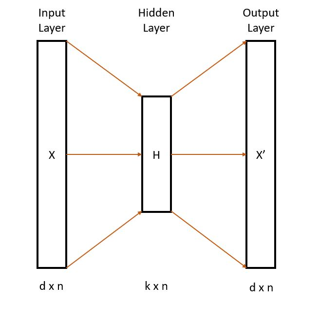
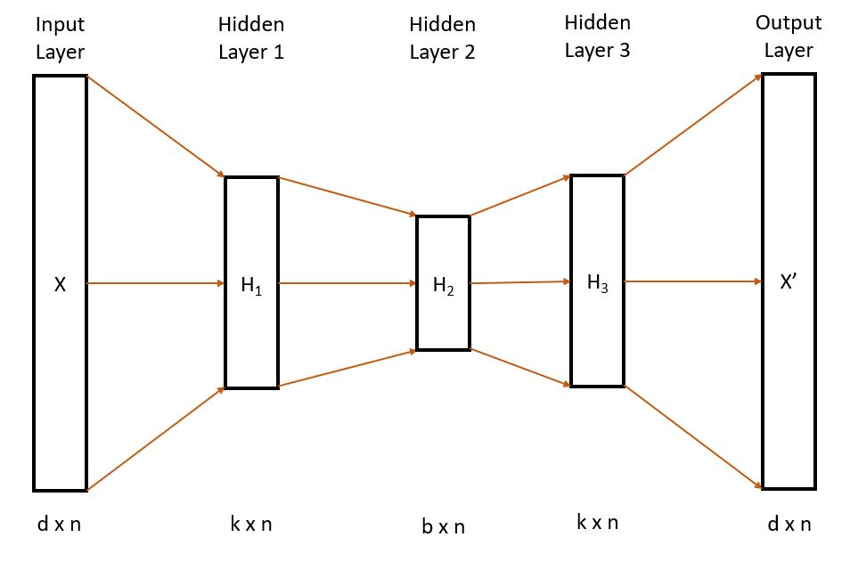

# deep-autoencoder_anomaly_detection

An Autoencoder is a neural network that tries to train intermediate weights in such a way to recreate the input at the output. In this project, I try to build a deep autoencoder for anomaly detection and compare the results with a few traditional machine learning algorithms. I will attempt to build and train two deep autoencoders, one with tensorflow and the other with google's H2O library for python.

## Basic Autoencoder
A basic autoencoder is a neural network architechture with 1 hidden layer with the dimensionality of the intermediate layer being less than the original data.

- n - number of observations
- d - number of features of original data
- k - number of features at the hidden layer (k<d)

## Deep Autoencoder
More complex functions can be learned by adding more hidden layers. By building deep autoencoders we can hope to better represent the input data by reconstructing it at the output layer after the forward pass on the trained network.

- n - number of observations
- d - number of features of original data
- k - number of features at the intermediate hidden layers (k<d)
- b - number of features at the central hidden layer (b<k)

## More about autoencoders
At a very high level, our goal is to produce X' such that MSE(X) = MSE(X') + e   where e is the reconstruction error and we would like this error to be extremely low. 

#### Sources to learn more:
- https://en.wikipedia.org/wiki/Autoencoder
- http://ufldl.stanford.edu/tutorial/unsupervised/Autoencoders/
- https://blog.keras.io/building-autoencoders-in-keras.html

## Work left to do
- Choose threshold for anomalies with precision-recall curves.
- Build model using H2O, compare speeds of development and AUC.
- Improve readme.
